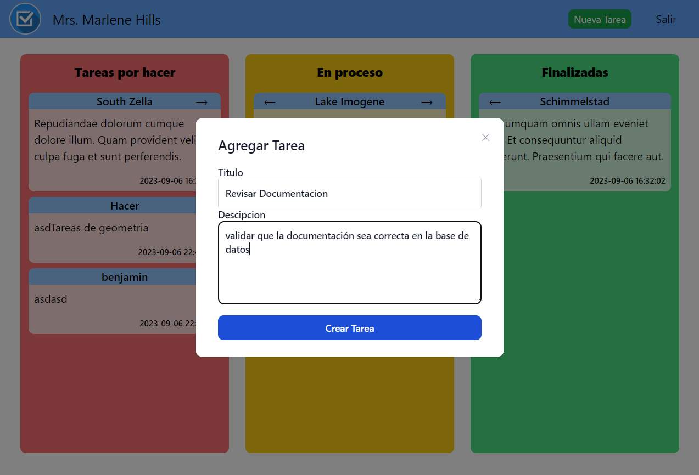

# Sistema de Gestión de Tareas en Laravel

## Descripción

Este proyecto es un sistema web de gestión de tareas desarrollado con el framework Laravel. Proporciona una plataforma sencilla y efectiva para que los usuarios administren sus tareas de manera organizada.

## Características Principales

- **Login de Usuario**: Los usuarios pueden iniciar sesión en sus cuentas para acceder y gestionar sus tareas de manera personalizada.

- **Creación de Tareas**: Los usuarios pueden crear nuevas tareas especificando su título y descripción. Esto permite registrar y planificar sus actividades pendientes de manera efectiva.

- **Categorización por Estado**: Las tareas se organizan en tres estados: "Por hacer," "En proceso" y "Finalizadas." Esto ayuda a los usuarios a seguir el progreso de sus tareas y proyectos.

- **Tareas por Usuario**: Este sistema está diseñado para la gestión de tareas personales, lo que significa que cada usuario solo tiene acceso y visibilidad de las tareas que ha creado. La privacidad de las tareas se mantiene para cada usuario.

- **Interfaz de Usuario Intuitiva**: La interfaz de usuario se ha diseñado cuidadosamente para ser fácil de usar y proporcionar una experiencia fluida a los usuarios. La navegación y la interacción son simples y efectivas.

## Requisitos del Sistema

- **PHP**: Versión 7.4 o superior.
- **Composer**: Para la gestión de dependencias de Laravel.
- **Node.js y npm** (opcional): Se requiere si se utiliza Laravel Mix para compilar activos.
- **MySQL u otro sistema de gestión de bases de datos compatible**.

## Uso

Una vez que la aplicación esté en funcionamiento, los usuarios pueden iniciar sesión en sus cuentas, crear nuevas tareas, organizarlas según su estado y visualizar sus actividades de manera organizada. La interfaz de usuario intuitiva facilita la administración de tareas y proyectos personales.

## Autores

- **Benjamin Tavarez**: [Enlace al perfil de GitHub](https://github.com/SirBeho)

## Vistas

